```mermaid
erDiagram
    %% ===== TABLES PRINCIPALES =====
    
    users ||--o{ conversations : "possède (1-N CASCADE)"
    users ||--o{ instruction_presets : "crée (1-N CASCADE)"
    users ||--o{ sessions : "utilise (1-N)"
    
    conversations ||--o{ messages : "contient (1-N CASCADE)"
    conversations }o--|| instruction_presets : "utilise (N-1 NULL ON DELETE)"
    
    messages }o--|| messages : "répond à (self-reference CASCADE)"
    
    %% ===== DÉFINITION DES TABLES =====
    
    users {
        BIGINT id PK "Auto-increment"
        VARCHAR name "Nom utilisateur"
        VARCHAR email UK "Email unique"
        TIMESTAMP email_verified_at "Vérification email"
        VARCHAR password "Hash mot de passe"
        TEXT two_factor_secret "Secret 2FA"
        TEXT two_factor_recovery_codes "Codes récupération 2FA"
        TIMESTAMP two_factor_confirmed_at "Confirmation 2FA"
        VARCHAR remember_token "Token remember me"
        VARCHAR last_model "Dernier modèle LLM utilisé"
        TEXT custom_instructions_about "Instructions personnelles (contexte)"
        TEXT custom_instructions_behavior "Instructions personnelles (comportement)"
        TEXT custom_instructions_commands "Instructions personnelles (commandes)"
        VARCHAR tone_style "Style de ton préféré"
        VARCHAR conciseness "Niveau de concision"
        VARCHAR titles_lists "Préférence titres/listes"
        VARCHAR warmth "Niveau de chaleur"
        VARCHAR enthusiasm "Niveau d'enthousiasme"
        VARCHAR formality "Niveau de formalité"
        VARCHAR emojis "Utilisation emojis"
        TIMESTAMP created_at "Date création"
        TIMESTAMP updated_at "Date MAJ"
    }
    
    conversations {
        BIGINT id PK "Auto-increment"
        BIGINT user_id FK "Propriétaire (CASCADE)"
        BIGINT instruction_preset_id FK "Preset utilisé (NULL ON DELETE)"
        VARCHAR model "Identifiant du modèle LLM"
        VARCHAR title "Titre conversation"
        TEXT custom_instructions_about "Instructions conversation (contexte)"
        TEXT custom_instructions_behavior "Instructions conversation (comportement)"
        TEXT custom_instructions_commands "Instructions conversation (commandes)"
        TIMESTAMP created_at "Date création"
        TIMESTAMP updated_at "Date MAJ"
    }
    
    messages {
        BIGINT id PK "Auto-increment"
        BIGINT conversation_id FK "Conversation parente (CASCADE)"
        BIGINT parent_message_id FK "Message parent (CASCADE self)"
        ENUM role "user, assistant, system"
        TEXT content "Contenu du message"
        TIMESTAMP created_at "Date création"
        TIMESTAMP updated_at "Date MAJ"
    }
    
    instruction_presets {
        BIGINT id PK "Auto-increment"
        BIGINT user_id FK "Créateur (NULL, CASCADE)"
        VARCHAR name "Nom du preset"
        TEXT description "Description preset"
        VARCHAR icon "Icône (emoji)"
        TEXT about "Instructions about"
        TEXT behavior "Instructions behavior"
        TEXT commands "Instructions commands"
        VARCHAR preferred_model "Modèle LLM préféré"
        BOOLEAN is_system "Preset système ou utilisateur"
        TIMESTAMP created_at "Date création"
        TIMESTAMP updated_at "Date MAJ"
    }
    
    failed_models {
        BIGINT id PK "Auto-increment"
        VARCHAR model_id UK "ID modèle LLM unique"
        TEXT last_error "Dernier message d'erreur"
        TIMESTAMP last_failed_at "Date dernière erreur"
        INT failure_count "Nombre d'échecs"
        TIMESTAMP created_at "Date création"
        TIMESTAMP updated_at "Date MAJ"
    }
    
    %% ===== TABLES SYSTÈME LARAVEL =====
    
    password_reset_tokens {
        VARCHAR email PK "Email utilisateur"
        VARCHAR token "Token de réinitialisation"
        TIMESTAMP created_at "Date création"
    }
    
    sessions {
        VARCHAR id PK "Session ID"
        BIGINT user_id FK "Utilisateur (INDEX)"
        VARCHAR ip_address "Adresse IP"
        TEXT user_agent "User agent navigateur"
        LONGTEXT payload "Données session sérialisées"
        INT last_activity "Timestamp dernière activité (INDEX)"
    }
    
    cache {
        VARCHAR key PK "Clé cache"
        MEDIUMTEXT value "Valeur sérialisée"
        INT expiration "Timestamp expiration"
    }
    
    cache_locks {
        VARCHAR key PK "Clé lock"
        VARCHAR owner "Propriétaire du lock"
        INT expiration "Timestamp expiration"
    }
    
    jobs {
        BIGINT id PK "Auto-increment"
        VARCHAR queue "Nom de la queue (INDEX)"
        LONGTEXT payload "Données job sérialisées"
        TINYINT attempts "Nombre de tentatives"
        INT reserved_at "Timestamp réservation"
        INT available_at "Timestamp disponibilité"
        INT created_at "Timestamp création"
    }
    
    job_batches {
        VARCHAR id PK "Batch ID"
        VARCHAR name "Nom du batch"
        INT total_jobs "Total jobs"
        INT pending_jobs "Jobs en attente"
        INT failed_jobs "Jobs échoués"
        LONGTEXT failed_job_ids "IDs jobs échoués"
        MEDIUMTEXT options "Options batch"
        INT cancelled_at "Timestamp annulation"
        INT created_at "Timestamp création"
        INT finished_at "Timestamp fin"
    }
    
    failed_jobs {
        BIGINT id PK "Auto-increment"
        VARCHAR uuid UK "UUID unique"
        TEXT connection "Connexion base de données"
        TEXT queue "Nom queue"
        LONGTEXT payload "Données job sérialisées"
        LONGTEXT exception "Stacktrace exception"
        TIMESTAMP failed_at "Date échec"
    }
```

## 📊 **Légende**

### **Relations**
- `||--o{` : Relation **1-N** (un vers plusieurs)
- `}o--||` : Relation **N-1** (plusieurs vers un)
- `CASCADE` : Suppression en cascade (si parent supprimé, enfants aussi)
- `NULL ON DELETE` : Si référence supprimée, FK devient NULL
- `self-reference` : Auto-référence (table pointe vers elle-même)

### **Types de colonnes**
- `PK` : Primary Key (clé primaire)
- `FK` : Foreign Key (clé étrangère)
- `UK` : Unique Key (valeur unique)
- `INDEX` : Index pour performances

### **Contraintes d'intégrité**

#### **users → conversations** (1-N CASCADE)
```php
$table->foreignId('user_id')->constrained()->onDelete('cascade');
```
Si un user est supprimé, toutes ses conversations sont supprimées.

#### **conversations → messages** (1-N CASCADE)
```php
$table->foreignId('conversation_id')->constrained()->onDelete('cascade');
```
Si une conversation est supprimée, tous ses messages sont supprimés.

#### **users → instruction_presets** (1-N CASCADE, nullable)
```php
$table->foreignId('user_id')->nullable()->constrained()->onDelete('cascade');
```
Si un user est supprimé, ses presets personnalisés sont supprimés.
Les presets système ont `user_id = NULL`.

#### **conversations → instruction_presets** (N-1 NULL ON DELETE)
```php
$table->foreignId('instruction_preset_id')->nullable()->constrained('instruction_presets')->nullOnDelete();
```
Si un preset est supprimé, les conversations l'utilisant ont leur `instruction_preset_id` mis à NULL.

#### **messages → messages** (self-reference CASCADE)
```php
$table->foreignId('parent_message_id')->nullable()->constrained('messages')->onDelete('cascade');
```
Auto-référence pour permettre les threads de messages (réponses à des messages).

---

## 🎯 **Tables Métier (Fonctionnalités principales)**

### **users**
Utilisateurs de l'application avec authentification (Fortify), 2FA, personnalisation.

### **conversations**
Conversations entre utilisateur et IA, avec preset et instructions personnalisées.

### **messages**
Messages individuels dans une conversation (role: user, assistant, system).

### **instruction_presets**
Presets d'instructions réutilisables (système ou utilisateur).
- Système (`is_system = true`): Créés par défaut (CV, Lettres, Entretiens)
- Utilisateur (`is_system = false`): Créés par les users

### **failed_models**
Tracking des modèles LLM en échec pour éviter de les réutiliser.

---

## 🔧 **Tables Système Laravel**

Gestion des sessions, cache, jobs asynchrones, réinitialisation mot de passe.

---

## 📈 **Statistiques Base de Données**

- **12 migrations** implémentées
- **12 tables** (5 métier + 7 système)
- **4 relations principales** avec contraintes d'intégrité
- **1 self-reference** (messages threading)
- **Contraintes CASCADE** pour intégrité référentielle
- **Indexes** sur clés étrangères pour performances
